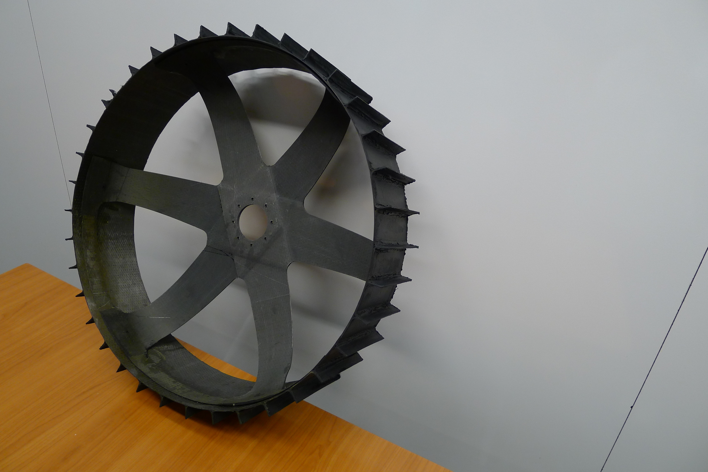
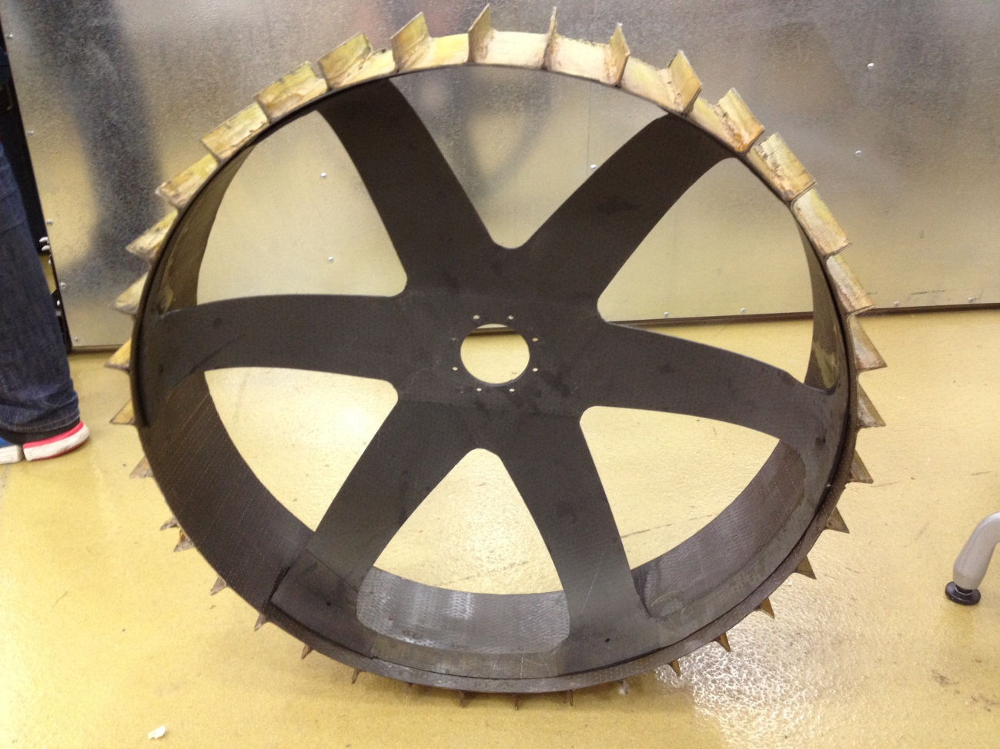
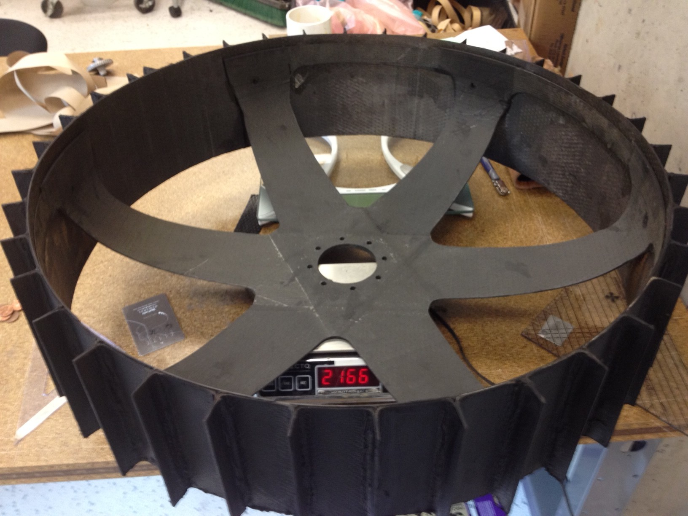
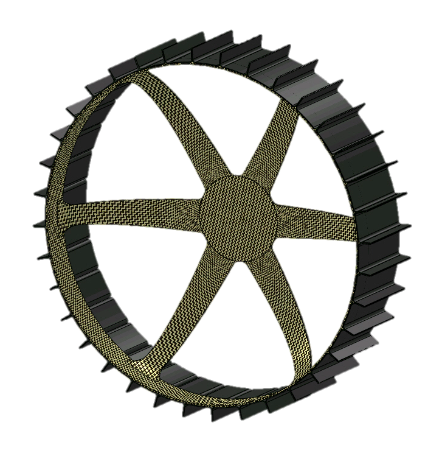
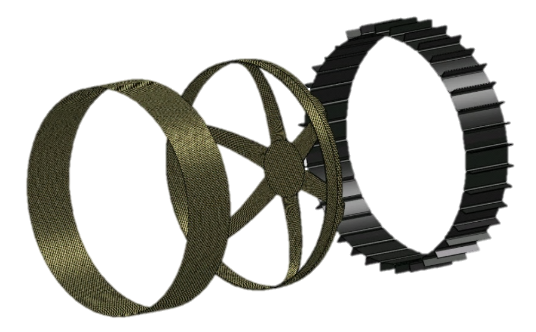
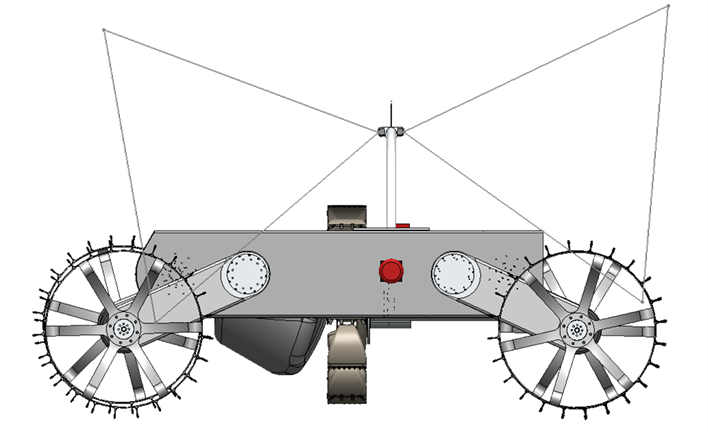

Built composite wheels for Astrobotic Lunar Excavator Polaris in a 4 members' team. Used Kevlar and carbon fiber. [[ document](wheelPaper.pdf)] [[ presentation](wheelPPT.pdf)]


  
  
  
  
  
  


---

