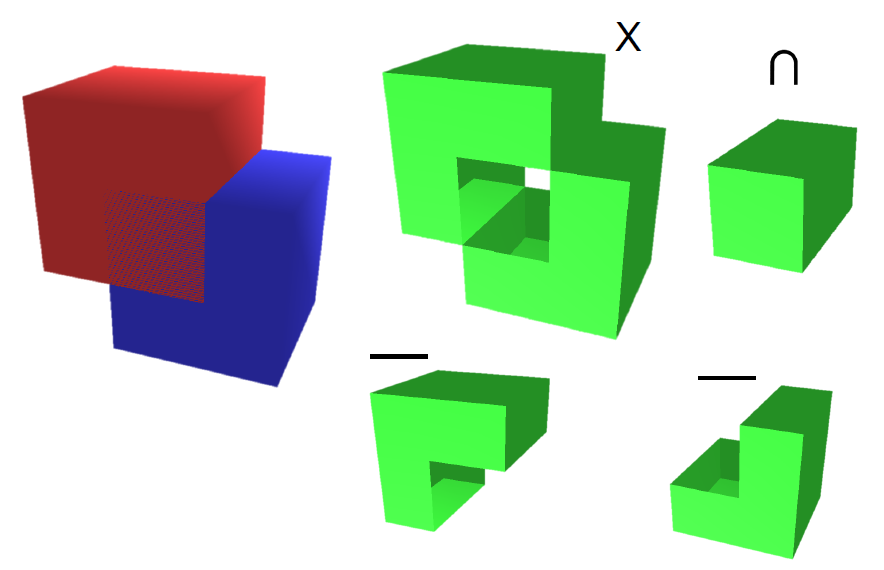
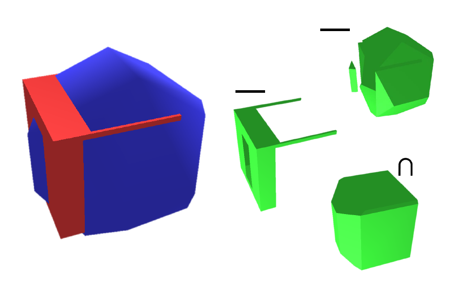
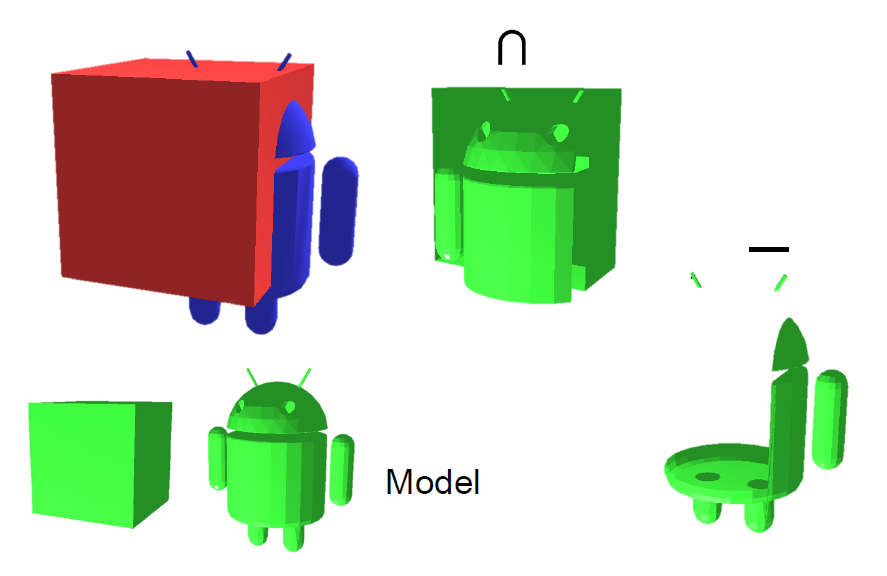
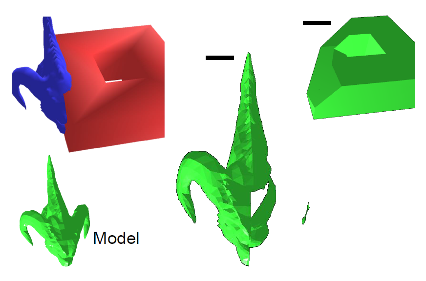

Developed a program to solve CSG problem by binary space partitioning in a 3 members' team. Elected as the most impressing project of the semester. Used C++ and OpenGL. [[ document](CSG_report.pdf)] [[ presentation](CSG_slides.pdf)]


  
  
  
  


---

