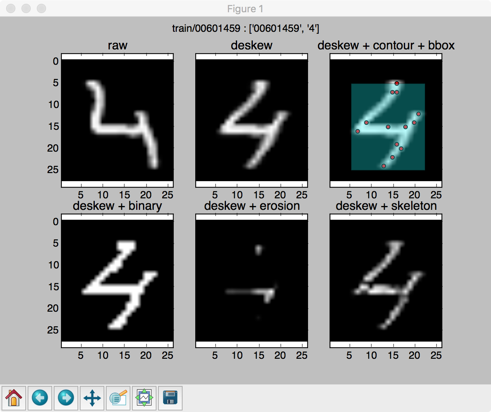

Implement machine learning to recognize hand-written digits in a 5 members' team. Best result training using Simple Convolutional Models (LeNet-5-like convolutional).


 source code
 
&nbsp;

 document
 


  





---

