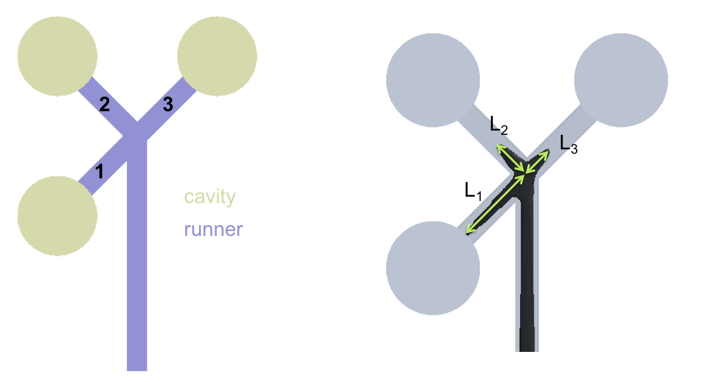
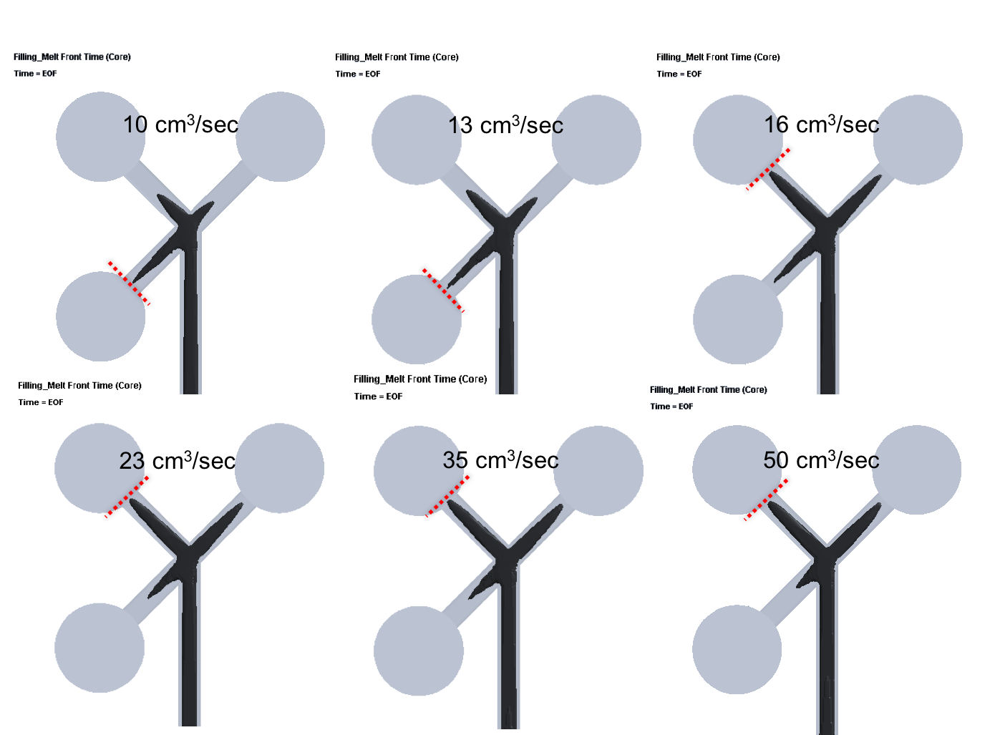

In this study, we have focused on dynamic behavior of core-material penetration in a co-injection multi-cavity molding. The dynamic behavior of core penetration is very sensitive to injection speed and also skin/core ratio. The largest core penetration has been shown to change dramatically from one runner to the other. In addition, the core penetration behavior will display imbalance at the end of filling. The more core ratio, the longer core penetration runs through runner to cavity. However, due to the multi-cavity geometrical structure, the balance of the core penetration for multi-cavity is still very challenging. Finally, the simulation is validated with the literature result. These results show both simulation and experiments are in a good agreement in trend.


 publication
 
&nbsp;

 extended article
 


  
  


---

