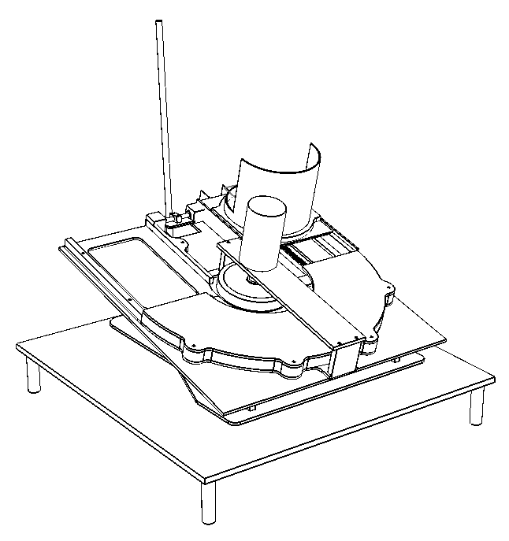
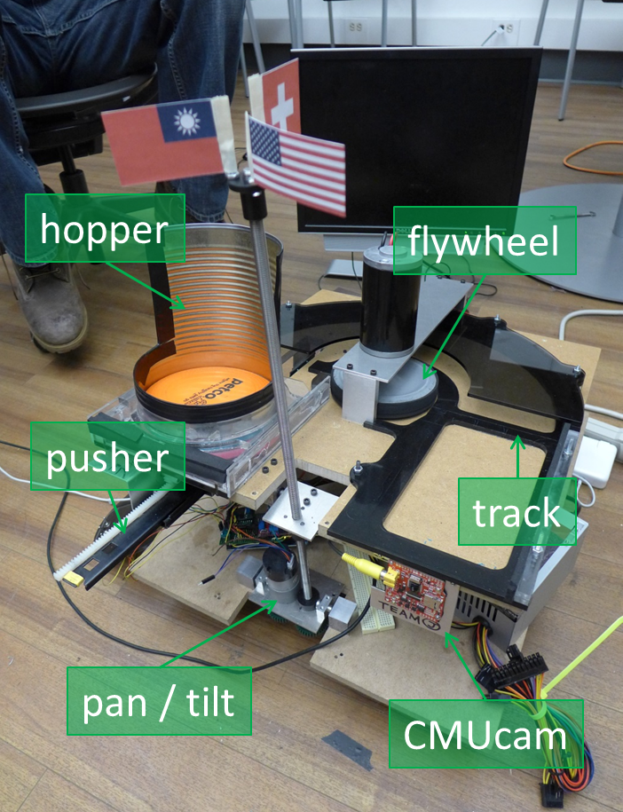
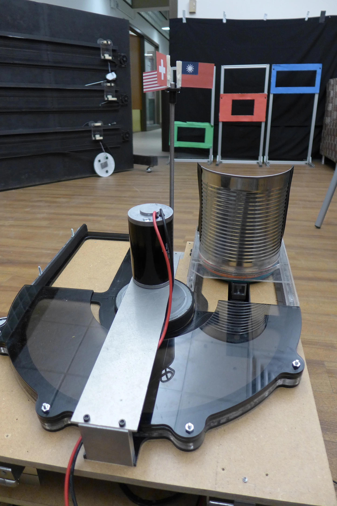
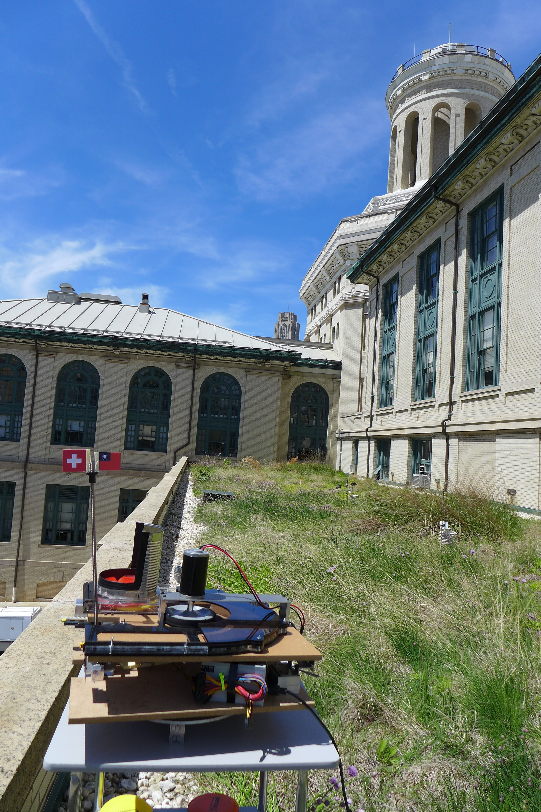

Built an autonomous color-aiming frisbee thrower in a 4 members' team. Used wood, Aluminum, acrylic, and CMUcam. [[ website](http://cmumechatronics2013teamj.blogspot.com/)] [[ document](TeamJ_FinalReport.pdf)]


  
  
  
  
  




---

