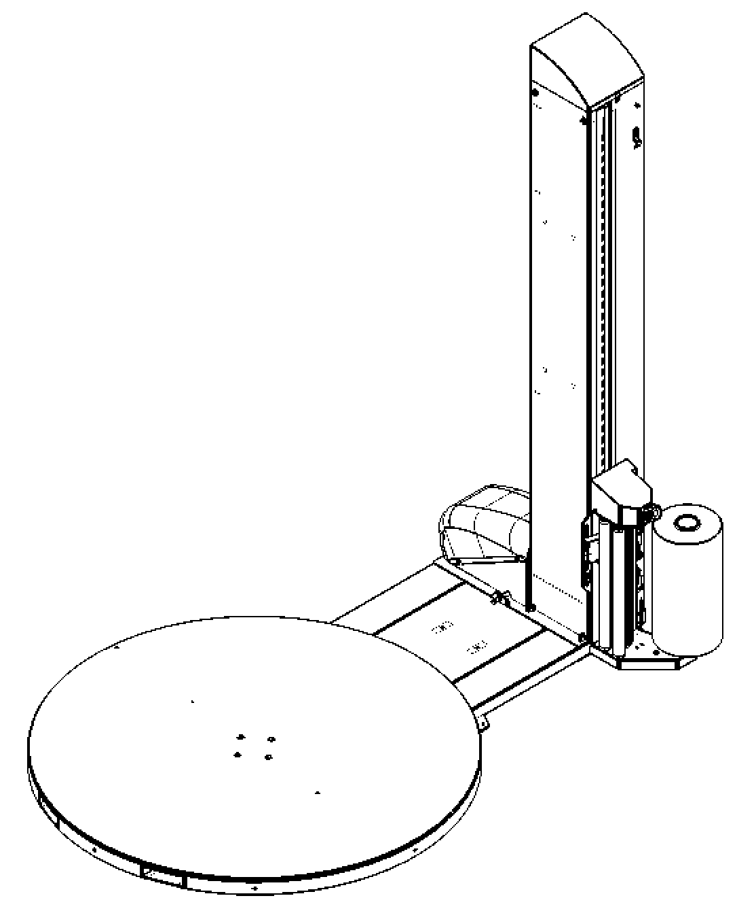
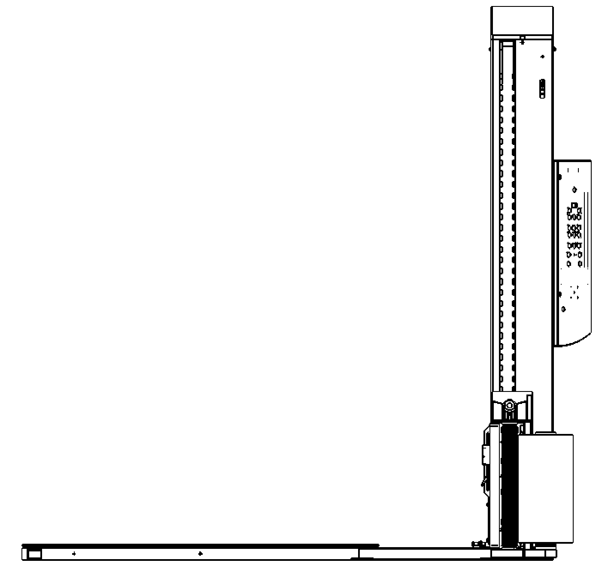
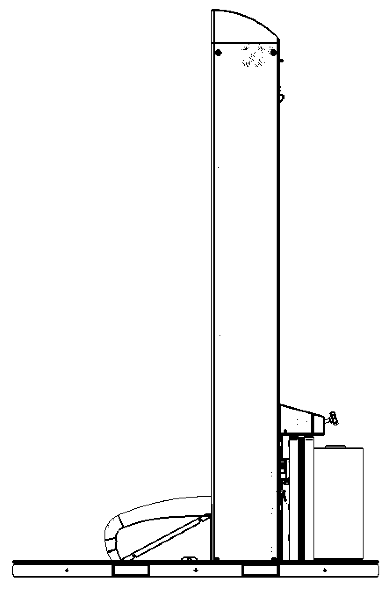
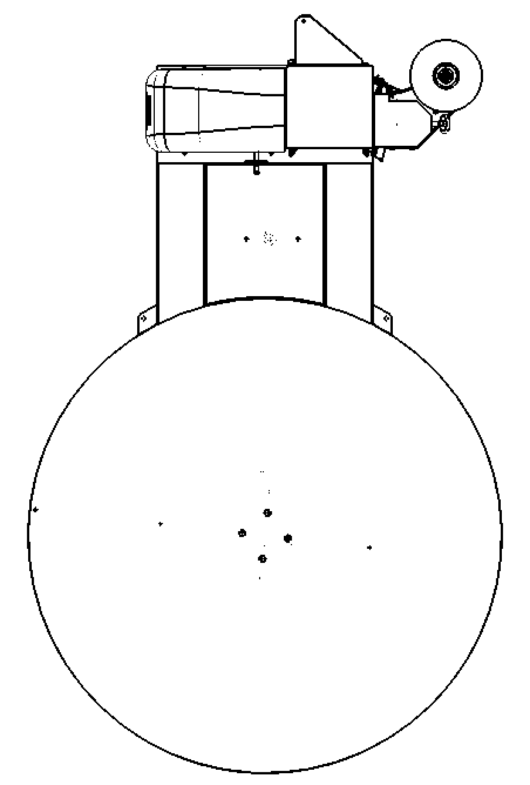

Designed & developed the appearance of pallet wrapping machine's form both for functionality & user-interface consideration, and perform for [Extend Great International Corporation](https://www.extendgroup.com.tw/products.php?uID=2).


  
  
  
  


---

