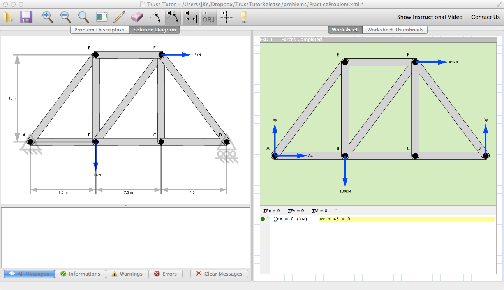
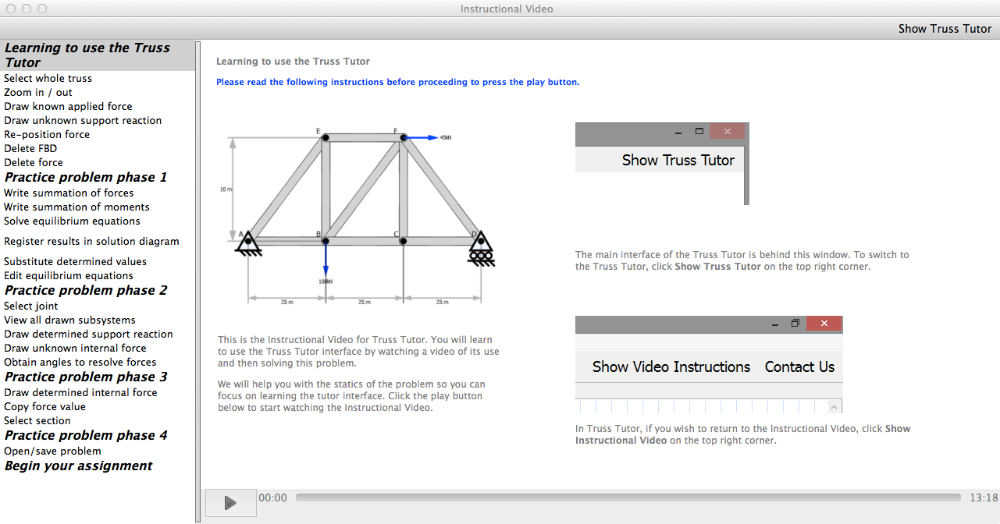
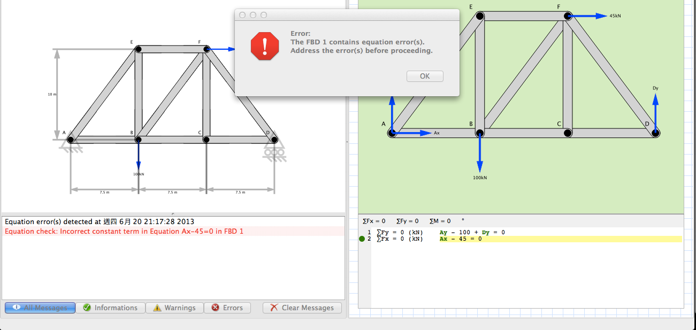

Developed a Truss Tutor software, which helps students to learn statics of truss with error checker and hints in the software. Collaborated with another member. Used C++ and QT. [[ extended article](https://peer.asee.org/20304)]


  
  
  




---

